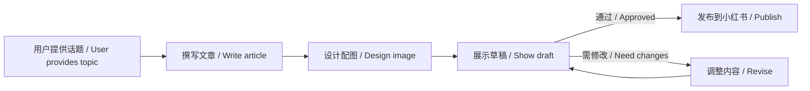

# Xiaohongshu Auto Publisher 小红书自动发布器 🚀

[](https://claude.ai/claude-code)
[](LICENSE)
[](https://xiaohongshu.com)
[](https://github.com/bradstan/xiaohongshu-auto-publisher/stargazers)

> 自动化小红书内容创作与发布流程 - 从话题生成到定时发布的端到端解决方案
>
> Automated end-to-end workflow for creating and publishing content to Xiaohongshu (Little Red Book), from topic generation to scheduled publication.

---

## ✨ Features / 特性

- 📝 **Automated Article Writing / 自动文章创作**: Generate engaging XHS-style articles from topics
- 🎨 **Multiple Image Generation Options / 多种图片生成方式**: Support for various AI image generators
- 👁️ **User Review Checkpoints / 用户审核检查点**: Always show draft before publishing
- ⏰ **Scheduled Publishing / 定时发布**: Set specific publish times (1 hour to 14 days in advance)
- 🏷️ **Smart Hashtag Suggestions / 智能话题标签**: Auto-generate relevant topic tags
- 🔄 **Iterative Refinement / 迭代优化**: Adjust content based on feedback

---

## 📋 Requirements & Prerequisites / 系统要求与前置条件

### Essential / 必需组件

1. **Claude Code or Codex**
   - Download: https://claude.ai/claude-code

2. **xiaohongshu-mcp Server**
   - Installation: See [xiaohongshu-mcp GitHub](https://github.com/)
   - Configure in Claude Code MCP settings

3. **Xiaohongshu Account / 小红书账号**
   - Mobile app required for login scanning
   - Cookies expire every 24 hours

### Optional / 可选组件

4. **Image Generation Tools / 图片生成工具** (choose one or more):
   - `baoyu-danger-gemini-web` (Gemini Web, FREE - recommended)
   - `baoyu-infographic` (Infographic design)
   - `baoyu-image-gen` (OpenAI/Google APIs)

**Note / 注意**: The skill will work without image generation, but you'll need to add images manually.

---

## 🚀 Quick Start / 快速开始

### Install / 安装

```bash
# Clone repository / 克隆仓库
git clone https://github.com/bradstan/xiaohongshu-auto-publisher.git ~/.claude/skills/xiaohongshu-auto-publisher

# Or copy manually / 或手动复制
cp -r xiaohongshu-auto-publisher ~/.claude/skills/
```

### Use / 使用

**Chinese / 中文：**
```
"帮我写一篇[话题]的文章并发布到小红书"
```

**English / 英文：**
```
"Help me write an article about [topic] and publish to Xiaohongshu"
```

---

## 🔄 Workflow / 工作流程



### Phase 1: Content Creation / 内容创作
- **Article Writing / 文章撰写**: Generate XHS-style articles with emojis / 生成带emoji的小红书风格文章
- **Image Design / 图片设计**: Create infographics using AI / 使用AI创建信息图

### Phase 2: User Review / 用户审核
- Present complete draft / 展示完整草稿
- Wait for approval / 等待确认
- Make revisions / 进行修改

### Phase 3: Publishing / 发布阶段
- Immediate or scheduled publish / 立即或定时发布
- Auto-add hashtags / 自动添加话题标签
- Verify success / 验证成功

---

## 🎨 Image Generation Options / 图片生成方式

| Method / 方式 | Cost / 成本 | Quality / 质量 | Notes / 说明 |
|---------------|------------|---------------|-------------|
| **Gemini Web** (Recommended) | Free / 免费 | High / 高 | One-time consent required / 需一次性同意 |
| **BigModel AI** (智谱AI) | ¥0.4/张 | High / 高 | Chinese text only / 仅中文，不推荐用于信息图 |
| **OpenAI/Google APIs** | Varies / 变化 | Excellent / 优秀 | API keys required / 需要API密钥 |

**Recommendation / 推荐**: Use Gemini Web for free generation, or prepare images manually for best quality.
使用Gemini Web免费生成，或手动准备图片以获得最佳质量。

---

## 📖 Usage Examples / 使用示例

### Example 1: Simple Topic / 简单话题
```
"帮我写一篇关于Clawdbot AI的文章并发布到小红书"
```

### Example 2: With Requirements / 带具体要求
```
"用xiaohongshu-auto-publisher发布：
话题：期权交易策略
时间：明晚9点定时发布
要求：技术向，需要数据图表"
```

### Example 3: Scheduled Publishing / 定时发布
```
"写一篇关于量化交易的文章，明天晚上21:03发布到小红书"
```

---

## 📁 Project Structure / 项目结构

```
xiaohongshu-auto-publisher/
├── SKILL.md              # 主技能文档 / Main skill documentation
├── article-template.md   # 文章模板指南 / Article template guide
└── README.md             # 本文件 / This file
```

---

## 📝 Article Template / 文章模板

### Title Formulas / 标题公式

- Problem-based / 问题型: "为什么[现象]让[目标]困扰？"
- Benefit-based / 利益型: "[时间/成本]搞定[目标]"
- Emotional-based / 情感型: "终于！[结果]让我[情感]"
- Data-based / 数据型: "[数字]%的人不知道的[技巧]"

### Content Structure / 内容结构

1. **Opening / 开头** (50-100字): Scenario-based / 场景化描述
2. **Main Body / 正文** (600-800字):
   - 🔥 Phenomenon / 现象背景
   - 💡 Principles / 核心原理
   - ⚡️ Methods / 方法策略
   - 💰 Benefits / 价值收益
   - ⚠️ Risks / 风险注意事项
3. **Closing / 结尾** (50-100字): Interactive / 互动提问

See `article-template.md` for complete guidelines / 参考完整指南。

---

## ⚙️ Configuration / 配置

### Xiaohongshu Login / 小红书登录

**Cookies Location / Cookie位置**: `~/cookies.json`

**Check Login Status / 检查登录状态**:
```bash
mcp__xiaohongshu-mcp__check_login_status
mcp__xiaohongshu-mcp__get_login_qrcode
```

**Note / 注意**: Cookies expire after ~24 hours / Cookie约24小时后过期

---

## 🔧 Troubleshooting / 故障排除

### Issue: Image generation failed / 图片生成失败
**Solution / 解决方案**: Try alternative methods / 尝试其他方式
1. Gemini Web (free / 免费)
2. BigModel AI (paid / 付费)
3. Manual creation / 手动创建

### Issue: Login required / 需要登录
**Solution / 解决方案**: Scan QR code with Xiaohongshu app
- Use mobile app / 使用手机App验证
- Session expires every 24h / 会话24小时过期

### Issue: Content not approved / 内容未通过
**Solution / 解决方案**: Provide feedback / 提供反馈
- "修改：[要求]" - Make changes / 进行修改
- "重新生成" - Regenerate / 重新生成
- "通过" - Approve / 通过并发布

---

## 📊 Performance / 性能对比

| Metric | Before / 之前 | After / 之后 | Improvement / 提升 |
|--------|---------------|-------------|-------------------|
| Article writing | 30-60 min | 1-2 min | **15-30x** |
| Image design | 1-2 hours | 2-3 min* | **20-40x** |
| Publishing | 5-10 min | 1-2 min | **3-5x** |
| **Total time** | **1.5-3 hours** | **6-12 min** | **10-15x faster** |

*Depends on image generation method / 取决于图片生成方式

---

## 🤝 Contributing / 贡献

Contributions are welcome! / 欢迎贡献！
Please feel free to submit a Pull Request / 请随时提交PR。

---

## 📄 License / 许可证

MIT License - see [LICENSE](LICENSE) file for details.

---

## 🙏 Acknowledgments / 致谢

- [Claude Code](https://claude.ai/claude-code)
- [xiaohongshu-mcp](https://github.com/) MCP server
- [Gemini Web](https://gemini.google.com/)
- [BigModel AI](https://www.bigmodel.cn/)

---

## 📮 Support / 支持

- Open an issue on GitHub / 在GitHub上提issue
- [Claude Code community](https://claude.ai/claude-code)

---

## 🌟 Star History

If you find this skill helpful, please give it a ⭐!
如果你觉得这个skill有用，请给它一个⭐！

---

Made with ❤️ by [bradstan](https://github.com/bradstan)
